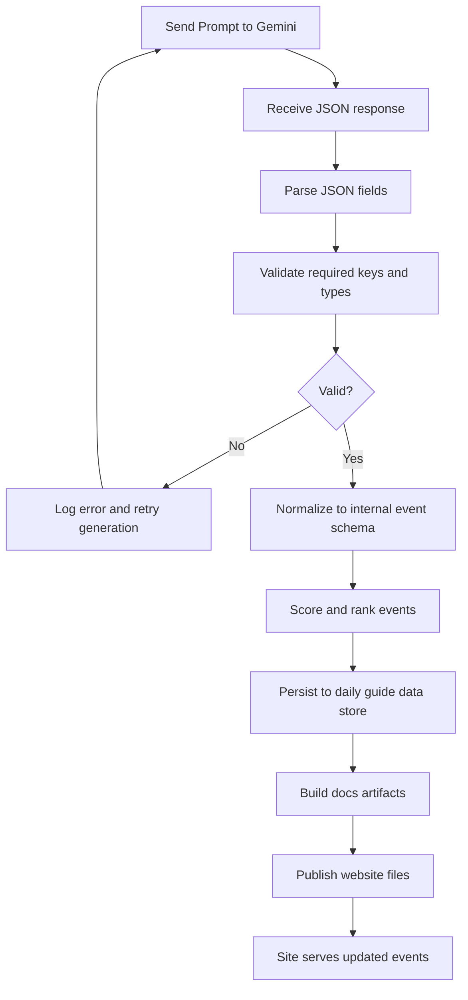

# Prompts For Gemini (Only)

## Prompt 1

You are curating quirky local happenings for Charlotte On The Run.

DATE
- Today: April 21, 2026
- Timezone: America/New_York

GOAL
- Generate 5 weird-but-plausible event concepts for today and the next 7 days.
- Prioritize originality, local flavor, and clear attendee value.
- Keep each event concise, vivid, and publication-ready.

EVENT CLASSES
- midnight-music
- food-chaos
- time-travel-history
- tiny-parade
- moonlight-swap

CLASS REQUIREMENTS
- midnight-music: must include music format twist + movement constraint
- food-chaos: must include surprise ingredient mechanic + timed challenge
- time-travel-history: must include decade roleplay + interactive activity
- tiny-parade: must include inanimate-object theme + judging rubric
- moonlight-swap: must include keepsake exchange + 60-second story rule

OUTPUT FORMAT
Return a JSON array with exactly 5 objects, one per class, using this schema:
- id: string (kebab-case, unique)
- class: string (one of EVENT CLASSES)
- title: string (max 70 chars)
- date: string (YYYY-MM-DD, between 2026-04-21 and 2026-04-28)
- start_time_local: string (HH:MM, 24h)
- neighborhood: string
- venue_type: string
- concept: string (2 sentences max)
- rules: array of 3 short strings
- audience: string
- price_band: string (free | $ | $$ | $$$)
- weirdness_score: integer 1-10
- feasibility_score: integer 1-10
- promo_blurb: string (max 160 chars)

QUALITY BAR
- No generic festival wording.
- No repeated mechanics across events.
- Must feel specific to Charlotte neighborhoods and community spaces.
- Keep safety and legality realistic.
- If uncertain about factual venues, use clearly hypothetical but plausible locations.

SEED IDEAS TO INSPIRE STYLE
- Midnight Silent Disco on Roller Skates
- Reverse Farmers Market
- Historic Time-Travel Walking Tour
- Tiny Parade for Inanimate Objects
- Moonlight Treasure Swap

Return JSON only, no markdown, no explanation.

## Prompt 2

You are generating after-hours oddball events for Charlotte On The Run.

DATE
- Today: April 21, 2026
- Timezone: America/New_York

GOAL
- Produce 5 events optimized for 6:00 PM to 1:00 AM across the next 7 days.
- Make each concept socially engaging and safe for public participation.

EVENT CLASSES
- midnight-music
- food-chaos
- time-travel-history
- tiny-parade
- moonlight-swap

HARD RULES
- Exactly one event per class.
- At least 3 different neighborhoods across the 5 events.
- No duplicate venue_type values.
- At least 2 free events.

OUTPUT FORMAT
Return JSON with key "events" containing 5 objects and key "meta" containing:
- generated_for_date: "2026-04-21"
- timezone: "America/New_York"

Each event object must include:
- id, class, title, date, start_time_local, end_time_local, neighborhood, venue_type
- concept (max 2 sentences)
- interaction_hook (one sentence)
- rules (exactly 3)
- accessibility_note (one sentence)
- price_band
- weirdness_score (1-10)
- feasibility_score (1-10)
- promo_blurb (max 140 chars)

QUALITY BAR
- Keep language specific and punchy.
- Avoid cliches like "fun for everyone".
- Ensure concepts are logistically plausible for a city guide.

Return JSON only.

## Mermaid: Parse and Keep for Website

## Prompt 3

You are creating quirky, family-friendly event ideas for Charlotte On The Run.

DATE
- Today: April 21, 2026
- Timezone: America/New_York

GOAL
- Create 5 weird events suitable for mixed ages (kids, teens, adults).
- Keep tone playful, inclusive, and practical.

EVENT CLASSES
- midnight-music
- food-chaos
- time-travel-history
- tiny-parade
- moonlight-swap

FAMILY CONSTRAINTS
- End time must be 9:30 PM or earlier.
- No alcohol-centric framing.
- Include one sentence about supervision or age guidance.

OUTPUT FORMAT
Return a JSON array of 5 events with:
- id
- class
- title
- date (2026-04-21 to 2026-04-28)
- start_time_local
- end_time_local
- neighborhood
- venue_type
- age_band (all-ages | 8+ | 12+ | teen+)
- concept
- family_note
- rules (3 items)
- materials_needed (2-4 items)
- price_band
- weirdness_score
- feasibility_score
- promo_blurb

STYLE
- Keep each concept concrete, visual, and easy to run.
- Mention at least one Charlotte-adjacent neighborhood cue per event.

Return JSON only.

## Prompt 4

You are ideating low-cost strange events for Charlotte On The Run.

DATE
- Today: April 21, 2026
- Timezone: America/New_York

GOAL
- Generate 5 weird event concepts with minimal setup costs.
- Emphasize public spaces, simple materials, and volunteer-friendly formats.

EVENT CLASSES
- midnight-music
- food-chaos
- time-travel-history
- tiny-parade
- moonlight-swap

BUDGET CONSTRAINTS
- 3 events must be free.
- Remaining events must be "$" only.
- Include estimated setup_cost_usd for each event.
- setup_cost_usd must be <= 150.

OUTPUT FORMAT
Return JSON array of 5 objects with:
- id, class, title, date, start_time_local, neighborhood, venue_type
- concept
- setup_cost_usd (integer)
- volunteer_count_needed (integer)
- rules (3)
- risk_note (1 sentence)
- price_band
- weirdness_score
- feasibility_score
- promo_blurb

VALIDATION
- If any event violates budget constraints, regenerate that event before returning.

Return JSON only, no extra text.

## Prompt 5

You are generating bizarre, photogenic community events for Charlotte On The Run social channels.

DATE
- Today: April 21, 2026
- Timezone: America/New_York

GOAL
- Produce 5 highly shareable weird events for the coming week.
- Balance originality with realistic execution.

EVENT CLASSES
- midnight-music
- food-chaos
- time-travel-history
- tiny-parade
- moonlight-swap

SHAREABILITY CONSTRAINTS
- Each event needs one signature visual moment.
- Include a short hashtag suggestion per event.
- promo_blurb must be <= 120 chars and emotionally vivid.

OUTPUT FORMAT
Return JSON object:
- date_context: "2026-04-21"
- timezone: "America/New_York"
- events: [5 event objects]

Each event object fields:
- id
- class
- title
- date
- start_time_local
- neighborhood
- venue_type
- concept
- signature_visual
- hashtag
- rules (3 items)
- price_band
- weirdness_score (1-10)
- feasibility_score (1-10)
- promo_blurb

QUALITY BAR
- Avoid generic party language.
- Keep ideas community-centered, not brand-centered.
- Ensure each class has distinct mechanics.

Return JSON only.
