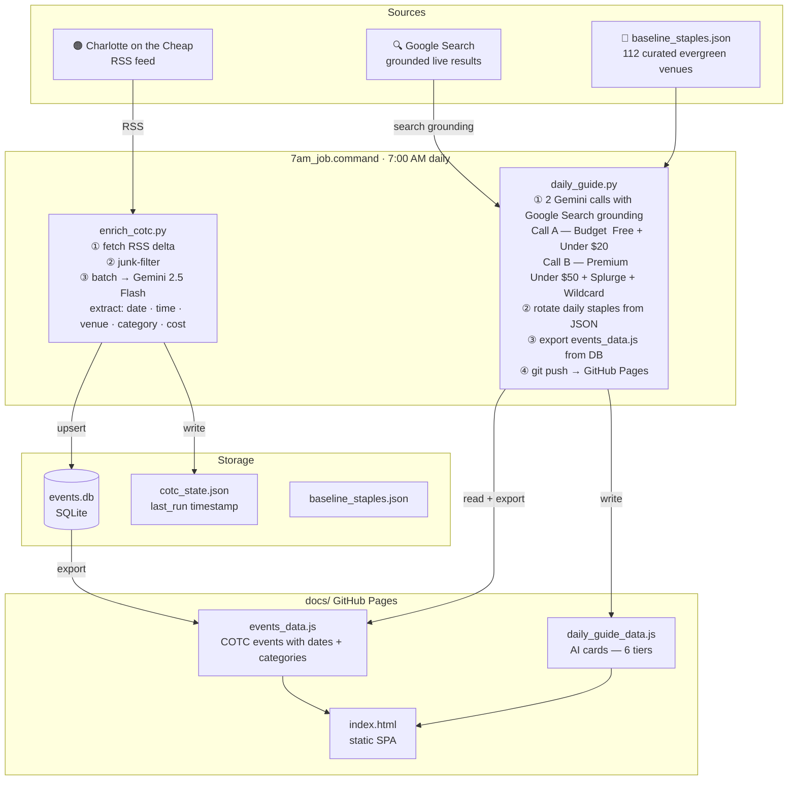
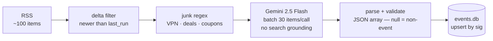

# Charlotte On The Run

Local event discovery portal for Charlotte, NC — updated daily at 7 AM via a two-step automated pipeline.

**Live site:** https://aaditya-327.github.io/Charlotte-on-the-Run/

---

## Data pipeline



---

## Output files

| File | Generated by | Contents |
|------|-------------|---------|
| `docs/events_data.js` | `daily_guide.py` ← `events.db` | Charlotte on the Cheap events with confirmed dates, times, venues, categories |
| `docs/daily_guide_data.js` | `daily_guide.py` | AI-generated event cards — 6 tiers, today + tomorrow |
| `docs/index.html` | manual | Static SPA — no build step, no server |
| `baseline_staples.json` | manual | 112 evergreen Charlotte venues ranked 1–5, day-of-year rotated |
| `events.db` | `enrich_cotc.py` | SQLite — COTC events with structured Gemini extraction |
| `cotc_state.json` | `enrich_cotc.py` | Delta-run state (last_run ISO timestamp) |

---

## AI tiers

| Tier | Max cost | Focus |
|------|----------|-------|
| 🆓 Free | $0 | Free concerts, pop-ups, community events on exact dates |
| 💵 Under $20 | ≤$20 | Trivia nights, run clubs, low-cover shows |
| 🍸 Under $50 | ≤$50 | Drag shows, live music, comedy nights |
| 🌟 Splurge | any | Major concerts, theater, VIP events |
| 🃏 Wildcard | any | Genuinely weird — must pass the "wait, that's a thing?" test |
| 📍 Staples | any | Evergreen venues; 10/day rotated by day-of-year offset |

---

## COTC enrichment

Charlotte on the Cheap RSS is parsed in two passes:



Extracted per event: `title` · `event_date` · `event_time` · `venue` · `neighborhood` · `cost` · `description` · `category[]` · `is_recurring`

---

## Category vocabulary

Shared between AI cards and COTC events:

`music` · `food` · `drinks` · `arts` · `outdoors` · `nightlife` · `comedy` · `sports` · `theater` · `fitness` · `market` · `drag` · `film` · `weird` · `family`

---

## Running manually

```bash
bash 7am_job.command                          # full pipeline

.venv/bin/python3 enrich_cotc.py              # step 1: RSS → events.db
.venv/bin/python3 daily_guide.py              # step 2: AI cards + export + push
.venv/bin/python3 daily_guide.py --no-push    # step 2 without git push
```

---

## Setup

```bash
python3 -m venv .venv
.venv/bin/pip install google-genai feedparser python-dotenv json-repair

# .env
GEMINI_API_KEY=your_key_here

# Install launchd job (7 AM daily)
cp com.charlotteontherun.guide.plist ~/Library/LaunchAgents/
launchctl load ~/Library/LaunchAgents/com.charlotteontherun.guide.plist
```
